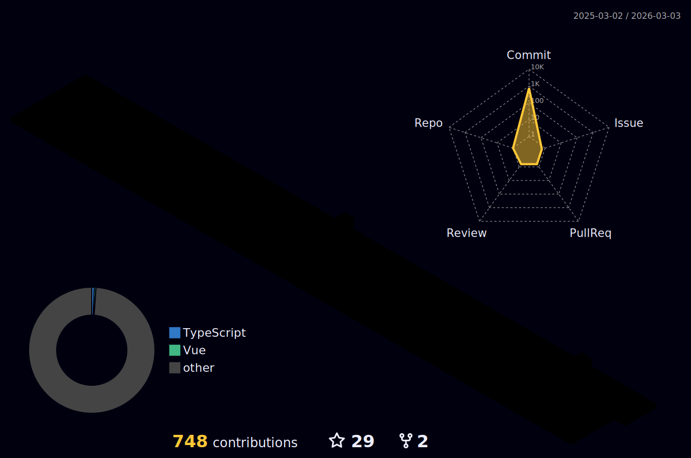

<!--  
 -->

### 🙇 안녕하십니까! 성장하는 개발자 InDaeGu를 소개합니다!
금융권 **하이브리드 앱(WebView)** 환경에서 프론트엔드(Vue.js 2)와 **Spring Boot** 서버를 함께 다루며, iOS/Android 네이티브와의 **브릿지(Bridge)** 연동, **Linux/DB 로그 기반 민원·장애 분석**, 배포 파이프라인 개선(Webpack/Jenkins/Docker)까지 **E2E로 문제를 해결**해온 개발자입니다. 하나금융티아이에서 하나저축은행 ITO(운영/개발)을 진행중입니다.

## 🛠️ Stacks
- **Programing Languages** :  
- **Framework/ Library** : 
     
- **Server/DBMS** : 
    
- **Tooling/ DevOps** :     
- **ETC** : 
  
 
> 핵심 스택: **Vue.js, Spring Boot, JavaScript, Java, PostgreSQL, Oracle, Jenkins, Docker, Linux**
 

## 💼 Experience (요약)

- 하나저축은행 앱 '하나원큐 저축은행–디지털뱅킹'의 **WebView(Frondend·Vue.js 2)** 및 **Spring Boot 서버** 개발
- iOS/Android **네이티브 개발자와 협업**하여 **JS 브릿지** 설계·구현
- **Linux & DB 로그 분석**으로 고객 이슈 재현 및 원인 규명, 운영 안정화
- **하나금융티아이**에 근무하며 하나저축은행 **ITO(개발·운영)** 수행
- **Webpack/Jenkins/Docker**로 빌드·배포 최적화 및 자동화

 

## 📬 Contact Me

- **Email** :  
 

## 🏆 Achievements
|Competition|Prize|Date|
|------|---|---|
|ICT&디지털혁신본부 2025 상반기 우수직원|우수직원|2025-07-31|
|마이크로소프트 클라우드 AI 모델 경진대회|최우수상|2024-10-28|
|한국소프트웨어기술진흥협회|프로젝트 최우수상|2023-12-29|
|ICT 한이음 공모전|한국정보산업연합회장상|2023-12-07|
 

## 📊 Stats

 

 

