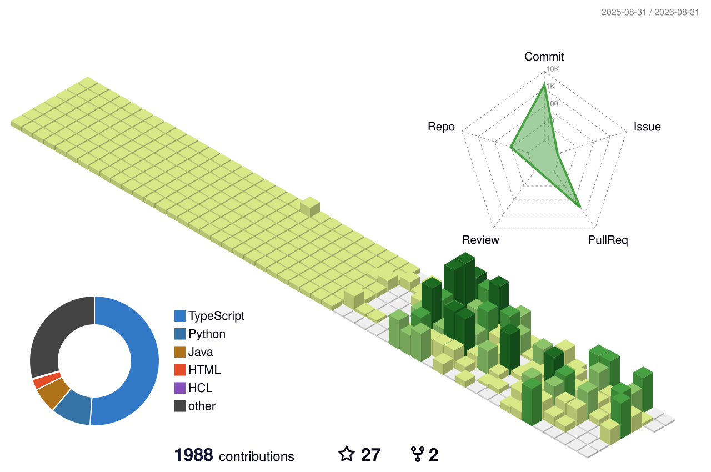

# 성창민 (Changmin Seong)

**Fullstack Developer / Product Engineer**

> “원래 이렇게 해요”를 그냥 넘기지 않는 개발자 성창민입니다.

**[포트폴리오에서 프로젝트와 구현 과정 보기 →](https://portfolio.hys1693359.workers.dev/)**

하나금융티아이에서 금융 서비스의 WebView와 Spring Boot 서버를 개발하고 운영합니다. 
화면과 서버, 서비스 출시 이후의 운영까지 살피며 반복되는 비효율을 개선합니다.

### 주요 기술

[Email](mailto:hys1693359@gmail.com)

### GitHub 기여 기록

<picture>
  <source media="(prefers-color-scheme: dark)" srcset="./profile-3d-contrib/profile-night-green.svg">
  <source media="(prefers-color-scheme: light)" srcset="./profile-3d-contrib/profile-green.svg">
  
</picture>
