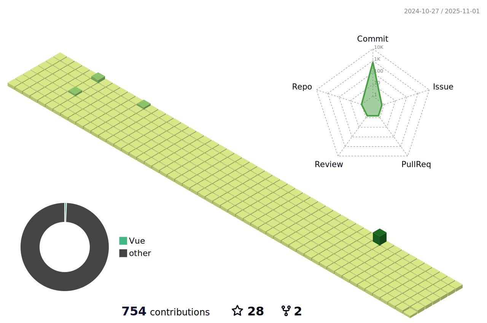

# Web Devleoper
- Junior Developer Preparing for Full Stack Developer
- Developers who build theory and working sense of development by carrying out various projects
- Developers who always challenge and learn new technology stacks with a spirit of constant challenge

🛠️ Stacks
- Programing Languages :      
- Framework/ Library :    
- Server :    
- Tooling/ DevOps :     
- ETC :  

🐱 Contact Me

  

🏆 Awards
|Competition|Prize|Date|
|------|---|---|

